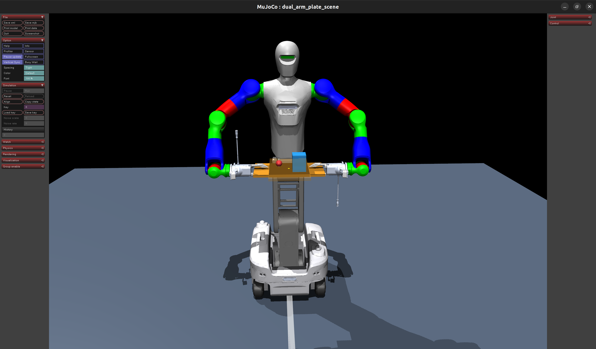

# 轮式移动双臂机器人协同稳载仿真系统

<p align="center">
  
</p>

## 项目全称

**轮式移动双臂机器人协同稳载仿真系统（双任务：水平搬水 + 板面小球驻留控制）**

## 1. 项目概述

本项目基于 MuJoCo 物理引擎，构建轮臂复合机器人（移动底盘 + 左右双机械臂）协同稳载仿真系统。双臂末端共同夹持一块刚性平板，平板上放置水杯（含水体重心刚体）和自由滚动小球，实现**双任务并行控制**：

### 任务一：搬水稳水平任务（最高优先级，硬约束）
- 平板放置水杯（含水体重心刚体），机器人平地移动时平板保持**绝对水平**
- 当底盘发生俯仰、侧倾（模拟上坡/倾斜路面），双臂实时补偿姿态，抵消底盘倾斜
- **目标**：让平板始终保持世界坐标系绝对水平，模拟防水洒出

### 任务二：板面小球驻留任务（次级优化任务）
- 同一块平板上放置自由滚动小球
- 依靠双臂协同平滑运动，让小球稳定停留在板面中心区域
- **目标**：小球不掉落、不飞出，始终驻留在中心

### 全局约束
- **平板禁止绕竖直 Z 轴旋转**，仅允许平移、俯仰、侧倾调平
- **全程运动学控制**，不涉及动力学力矩
- **必须位置闭环**，不能开环速度漂移
- **双臂必须严格协同**，保持平板刚性位姿不变

---

## 2. 开发环境

| 项目 | 说明 |
|------|------|
| 仿真引擎 | MuJoCo 3.x |
| 编程语言 | Python 3.8+ |
| 核心依赖 | `mujoco`, `numpy`, `scipy` |
| 控制方式 | 纯运动学速度/位置层级控制 |
| 硬件 | 无实物硬件，纯仿真 |

安装依赖：

```bash
pip install mujoco numpy scipy
```

---

## 3. 项目文件结构

```
BalanceDual-Arm/
├── README.md                                          # 本文档
├── images/
│   └── image.png                                      # 初始夹持姿态示意图
├── scene_dual_arm_plate.xml                           # 完整 MJCF 场景文件
├── dual_arm_controller.py                             # 双臂协同稳载控制主程序
├── KITT1_5V3robot_dual_dahuan_urdf/
│   ├── KITT1_5V3robot_dual_dahuan_urdf.xml            # 机器人本体 MJCF 模型
│   ├── KITT1_5V3robot_dual_dahuan_urdf.urdf           # URDF 源文件
│   ├── flange.dae                                     # 法兰 COLLADA 模型
│   └── *.STL                                          # 106 个 STL 网格文件
├── mjcf_viewer.py                                     # 原有模型查看器
└── MUJOCO_LOG.TXT                                     # 运行日志
```

---

## 4. 机器人结构

### 4.1 机器人本体（KITT1_5V3）

| 部位 | 关节数 | 关节类型 | 关节名称 |
|------|--------|----------|----------|
| 腿部（4条） | 8 | 铰链 | `ZQ`, `ZQL`, `YQ`, `YQL`, `ZH`, `ZHL`, `YH`, `YHL` |
| 躯干 | 4 | 铰链 | `trunk_joint_1` ~ `trunk_joint_4` |
| 左臂 | 7 | 铰链 | `left_arm_joint_1` ~ `left_arm_joint_7` |
| 右臂 | 7 | 铰链 | `right_arm_joint_1` ~ `right_arm_joint_7` |
| 头部 | 2 | 铰链 | `head_joint_1` ~ `head_joint_2` |
| 手指 | 4 | 滑动 | `leftfinger1/2`, `rightfinger1/2` |
| **合计** | **32** | | |

### 4.2 运动学链（双臂关键链路）

```
Trunk4 (躯干顶层)
├── Joint1_L → Joint2_L → ... → Joint7_L (左臂 TCP)
│   └── leftfinger1, leftfinger2 (左手爪)
└── Joint1_R → Joint2_R → ... → Joint7_R (右臂 TCP)
    └── rightfinger1, rightfinger2 (右手爪)
```

左右臂各 7 个旋转关节，均为绕 Z 轴的铰链关节。左右臂基座对称安装于 Trunk4 的 `y = ±0.2254m` 处。

### 4.3 执行器配置

全部 30 个关节使用 `position` 位置型执行器，通过 PID 闭环跟踪目标位置：

| 关节组 | kp (比例增益) | ctrlrange |
|--------|---------------|-----------|
| 腿部 | 100 | [-3.14, 3.14] |
| 躯干 | 50~200 | 各关节独立 |
| 手臂 | 20~50 | 各关节独立 |
| 手指 | 20 | [0, 0.023] |
| 头部 | 30 | 各关节独立 |

---

## 5. 控制架构

### 5.1 控制链路（严格层次化）

```
┌──────────────────────────────────────────────────────────────┐
│                    第0层：顶层输入                             │
│         平板中心线速度 v_plate、角速度 ω_plate                  │
│         （含底盘倾斜补偿角速度 ω_comp）                         │
├──────────────────────────────────────────────────────────────┤
│                    第1层：姿态补偿                             │
│  ┌─────────────────────────────────────────────────────────┐ │
│  │ 读取底盘实时俯仰角 θ_pitch、滚转角 θ_roll              │ │
│  │ 生成反向补偿角速度：                                    │ │
│  │   ω_comp = -K · [θ_roll, θ_pitch, 0]                   │ │
│  │ 叠加进平板中心角速度：                                  │ │
│  │   ω_plate_des = ω_comp + ω_trajectory                  │ │
│  │ 强制：ω_z = 0（禁止Z轴旋转）                           │ │
│  └─────────────────────────────────────────────────────────┘ │
├──────────────────────────────────────────────────────────────┤
│                    第2层：速度旋量坐标变换                      │
│  ┌─────────────────────────────────────────────────────────┐ │
│  │ 将平板中心速度旋量 (v_plate, ω_plate)                   │ │
│  │ 变换为左右 TCP 期望速度：                               │ │
│  │                                                         │ │
│  │ 左臂：v_tcp_L = v_plate + ω_plate × r_L              │ │
│  │       ω_tcp_L = ω_plate                               │ │
│  │                                                         │ │
│  │ 右臂：v_tcp_R = v_plate + ω_plate × r_R              │ │
│  │       ω_tcp_R = ω_plate                               │ │
│  │                                                         │ │
│  │ 其中 r_L, r_R 为平板中心到左/右 TCP 的世界坐标向量      │ │
│  └─────────────────────────────────────────────────────────┘ │
├──────────────────────────────────────────────────────────────┤
│                    第3层：雅可比逆解算                          │
│  ┌─────────────────────────────────────────────────────────┐ │
│  │ 双臂分别求解几何雅可比矩阵 J(q) ∈ R^(6×7)：              │ │
│  │                                                         │ │
│  │   [v_tcp; ω_tcp] = J(q) · dq                           │ │
│  │                                                         │ │
│  │ 使用阻尼最小二乘（DLS）伪逆：                            │ │
│  │                                                         │ │
│  │   dq = J^T · (J·J^T + λ²·I)^(-1) · [v_tcp; ω_tcp]    │ │
│  │                                                         │ │
│  │ 或使用 SVD 伪逆（冗余 7-DOF 机械臂有1维零空间）         │ │
│  └─────────────────────────────────────────────────────────┘ │
├──────────────────────────────────────────────────────────────┤
│                    第4层：数值积分                             │
│  ┌─────────────────────────────────────────────────────────┐ │
│  │ 关节角速度积分 → 目标关节位置：                          │ │
│  │                                                         │ │
│  │   q_target = q_current + dq · dt                        │ │
│  │                                                         │ │
│  │ 关节限位钳制：                                          │ │
│  │   q_target = clamp(q_target, q_min, q_max)             │ │
│  └─────────────────────────────────────────────────────────┘ │
├──────────────────────────────────────────────────────────────┤
│                    第5层：底层驱动                             │
│  ┌─────────────────────────────────────────────────────────┐ │
│  │ 将 q_target 写入 position 型执行器 ctrl 数组：          │ │
│  │                                                         │ │
│  │   self.data.ctrl[actuator_id] = q_target               │ │
│  │                                                         │ │
│  │ MuJoCo 内部 PID 跟踪：                                   │ │
│  │   τ = kp · (q_target - q_current)                      │ │
│  └─────────────────────────────────────────────────────────┘ │
└──────────────────────────────────────────────────────────────┘
```

### 5.2 双任务优先级策略

| 优先级 | 任务 | 实现方式 | 约束 |
|--------|------|----------|------|
| **第1优先级（硬约束）** | 搬水稳水平 | 姿态补偿角速度直接叠加到 ω_plate | 不可被破坏 |
| **第2优先级（软约束）** | 小球驻留 | 基于小球偏移的附加角速度，通过零空间投影施加 | 允许小幅偏差 |

**零空间柔顺优化原理**：

7-DOF 机械臂的雅可比矩阵零空间维度 = 7 - 6 = 1。在完成主任务（稳水平）后，可在零空间内优化次级目标（小球驻留），不影响主任务执行。

```
dq = J⁺ · v_tcp_primary + (I - J⁺·J) · dq_secondary
     └── 主任务 ──┘   └──── 零空间投影 ────┘
```

### 5.3 核心约束规则

| 编号 | 约束 | 实现 |
|------|------|------|
| 1 | **禁止平板 Z 轴旋转** | 强制设置 `ω_z = 0` |
| 2 | **全程运动学控制** | 不使用力矩/力控制，仅速度→位置 |
| 3 | **必须位置闭环** | 速度积分→位置→position执行器PID跟踪 |
| 4 | **禁止 qpos 写赋值** | 仅读取 qpos 状态，控制通过 ctrl 数组 |
| 5 | **双臂严格协同** | 同一个 v_plate/ω_plate 驱动双臂 |
| 6 | **关节限位保护** | 每次积分后钳制在 joint range 内 |

---

## 6. 姿态补偿核心逻辑

### 6.1 数学原理

设底盘坐标系相对世界坐标系有俯仰角 `θ_pitch` 和滚转角 `θ_roll`。

平板需要保持世界坐标系绝对水平（即平板法向量始终沿世界 Z 轴），需要在平板角速度中加入反向补偿：

```
ω_comp_x = -K_p · θ_roll      （绕世界X轴补偿滚转）
ω_comp_y = -K_p · θ_pitch     （绕世界Y轴补偿俯仰）
ω_comp_z = 0                  （禁止绕Z轴旋转！）
```

### 6.2 伪代码

```python
# 获取底盘姿态
roll, pitch = get_chassis_roll_pitch()

# 计算补偿角速度
w_comp = np.array([
    -K_attitude * roll,    # X轴角速度，补偿滚转
    -K_attitude * pitch,   # Y轴角速度，补偿俯仰  
    0.0                    # Z轴固定为0
])

# 叠加到平板期望角速度
w_plate_desired = w_comp + w_trajectory

# 强制Z轴禁止旋转
w_plate_desired[2] = 0.0
```

### 6.3 效果验证

- 底盘前倾 +10° → 平板产生 -K·10° 的俯仰角速度 → 平板反向旋转 → 恢复水平
- 底盘右倾 +5° → 平板产生 -K·5° 的滚转角速度 → 平板反向旋转 → 恢复水平
- 姿态收敛时间取决于 K_attitude 增益

---

## 7. 仿真场景物体配置

### 7.1 物体清单

| 物体 | 几何类型 | 物理类型 | 说明 |
|------|----------|----------|------|
| 地面 | `plane` | 静态 | 无限大平面 |
| 平板 | `box 0.3×0.15×0.01` | free 浮体 | 双臂 TCP 协同夹持 |
| 水杯 | `box 0.04×0.04×0.05` | free 自由刚体 | 放置在平板上 |
| 水体质量 | `box 0.03×0.03×0.02` | free 自由刚体 | 模拟水体重心倾斜效果 |
| 小球 | `sphere r=0.02` | free 自由刚体 | 自由滚动，需驻留在中心 |
| 平板 mocap | `box 0.3×0.15×0.01` | mocap 运动学体 | 平板轨迹驱动源 |

### 7.2 物体物理规则

1. **平板**为 free 浮体，通过 `weld` 等式约束跟随 mocap 体运动，模拟双臂 TCP 协同夹持
2. **水杯、水体、小球**均为独立 free 自由刚体，仅靠接触力停留在板面
3. **水体**无法流体仿真，使用上层小质量刚体（`mass=0.1kg`）模拟重心偏移效果
4. 所有物体使用原生几何体（box、sphere）快速搭建，预留接口可替换为高精度模型

### 7.3 开发阶段策略

| 阶段 | 内容 |
|------|------|
| **初期** | 全部使用原生几何体（box、sphere、cylinder）快速搭建，保证算法先跑通 |
| **后期** | 代码结构预留接口，可替换为 Menagerie/YCB 开源高精度 MJCF 模型 |

### 7.4 `keyframe` 中 `qpos` 与关节对应关系

`scene_dual_arm_plate.xml` 的 `<keyframe>` 共 **60 维**（`nq=60`），按 MuJoCo 关节在 XML 中的出现顺序排列。自由关节（`freejoint`）占 7 维：`[x, y, z, qw, qx, qy, qz]`；铰链/滑动关节各占 1 维。

当前 keyframe 内容与索引对照如下：

```xml
<key name="initial" qpos="
    0.35   0.00  0.980  0.707107 0 0 0.707107   <!-- qpos[ 0: 7]  平板 plate_freejoint -->
    0.39   0.06  1.040  1 0 0 0                 <!-- qpos[ 7:14]  水杯 cup_freejoint -->
    0.39   0.06  1.065  1 0 0 0                 <!-- qpos[14:21]  水体 water_freejoint -->
    0.31  -0.06  1.010  1 0 0 0                 <!-- qpos[21:28]  小球 ball_freejoint -->
    0 0 0 0 0 0 0 0                             <!-- qpos[28:36]  腿部 8 铰链 -->
    0 0 0 0                                     <!-- qpos[36:40]  躯干 4 铰链 -->
    0 0 0 0 0 0 0                               <!-- qpos[40:47]  左臂 7 铰链 -->
    0 0                                         <!-- qpos[47:49]  左手指 2 滑动 -->
    0 0 0 0 0 0 0                               <!-- qpos[49:56]  右臂 7 铰链 -->
    0 0                                         <!-- qpos[56:58]  右手指 2 滑动 -->
    0 0                                         <!-- qpos[58:60]  头部 2 铰链 -->
"/>
```

| qpos 索引 | 维数 | 关节名称 | 类型 | keyframe 当前值 | 含义 |
|:---------:|:----:|----------|------|-----------------|------|
| `0:3` | 3 | `plate_freejoint` | free 位置 | `0.35, 0.00, 0.980` | 平板中心 xyz (m) |
| `3:7` | 4 | `plate_freejoint` | free 四元数 | `0.707107, 0, 0, 0.707107` | 绕 Z 轴 +90°（长边沿 Y） |
| `7:10` | 3 | `cup_freejoint` | free 位置 | `0.39, 0.06, 1.040` | 水杯 xyz |
| `10:14` | 4 | `cup_freejoint` | free 四元数 | `1, 0, 0, 0` | 无旋转 |
| `14:17` | 3 | `water_freejoint` | free 位置 | `0.39, 0.06, 1.065` | 水体 xyz |
| `17:21` | 4 | `water_freejoint` | free 四元数 | `1, 0, 0, 0` | 无旋转 |
| `21:24` | 3 | `ball_freejoint` | free 位置 | `0.31, -0.06, 1.010` | 小球 xyz |
| `24:28` | 4 | `ball_freejoint` | free 四元数 | `1, 0, 0, 0` | 无旋转 |
| `28` | 1 | `ZQ` | hinge | `0` | 左前腿髋 |
| `29` | 1 | `ZQL` | hinge | `0` | 左前腿膝 |
| `30` | 1 | `YQ` | hinge | `0` | 右前腿髋 |
| `31` | 1 | `YQL` | hinge | `0` | 右前腿膝 |
| `32` | 1 | `ZH` | hinge | `0` | 左后腿髋 |
| `33` | 1 | `ZHL` | hinge | `0` | 左后腿膝 |
| `34` | 1 | `YH` | hinge | `0` | 右后腿髋 |
| `35` | 1 | `YHL` | hinge | `0` | 右后腿膝 |
| `36` | 1 | `trunk_joint_1` | hinge | `0` | 躯干俯仰 1 |
| `37` | 1 | `trunk_joint_2` | hinge | `0` | 躯干俯仰 2 |
| `38` | 1 | `trunk_joint_3` | hinge | `0` | 躯干俯仰 3 |
| `39` | 1 | `trunk_joint_4` | hinge | `0` | 躯干偏航 |
| `40` | 1 | `left_arm_joint_1` | hinge | `0` | 左臂关节 1 |
| `41` | 1 | `left_arm_joint_2` | hinge | `0` | 左臂关节 2 |
| `42` | 1 | `left_arm_joint_3` | hinge | `0` | 左臂关节 3 |
| `43` | 1 | `left_arm_joint_4` | hinge | `0` | 左臂关节 4 |
| `44` | 1 | `left_arm_joint_5` | hinge | `0` | 左臂关节 5 |
| `45` | 1 | `left_arm_joint_6` | hinge | `0` | 左臂关节 6 |
| `46` | 1 | `left_arm_joint_7` | hinge | `0` | 左臂关节 7 |
| `47` | 1 | `leftfinger1_joint` | slide | `0` | 左手指 1（有执行器） |
| `48` | 1 | `leftfinger2_joint` | slide | `0` | 左手指 2（equality 镜像） |
| `49` | 1 | `right_arm_joint_1` | hinge | `0` | 右臂关节 1 |
| `50` | 1 | `right_arm_joint_2` | hinge | `0` | 右臂关节 2 |
| `51` | 1 | `right_arm_joint_3` | hinge | `0` | 右臂关节 3 |
| `52` | 1 | `right_arm_joint_4` | hinge | `0` | 右臂关节 4 |
| `53` | 1 | `right_arm_joint_5` | hinge | `0` | 右臂关节 5 |
| `54` | 1 | `right_arm_joint_6` | hinge | `0` | 右臂关节 6 |
| `55` | 1 | `right_arm_joint_7` | hinge | `0` | 右臂关节 7 |
| `56` | 1 | `rightfinger1_joint` | slide | `0` | 右手指 1（有执行器） |
| `57` | 1 | `rightfinger2_joint` | slide | `0` | 右手指 2（equality 镜像） |
| `58` | 1 | `head_joint_1` | hinge | `0` | 头部偏航 |
| `59` | 1 | `head_joint_2` | hinge | `0` | 头部俯仰 |

说明：

1. **实际仿真初始双臂姿态**由 `dual_arm_controller.py` 的 `load()` 通过 6D IK 写入 `qpos[40:47]` / `qpos[49:56]` 与 `ctrl[]`，不一定等于上表 keyframe 中的全零手臂角。
2. free 关节四元数顺序为 MuJoCo 约定的 **`(w, x, y, z)`**。
3. 手指 2 通过 equality 约束与手指 1 联动：`finger2 = -finger1`，一般只需控制 `*finger1_joint`。

---

## 8. 快速开始

### 8.1 运行仿真

```bash
# 进入项目目录
cd /home/lenovo/Frank/code/BalanceDual-Arm

# 启动仿真（无 GUI 模式）
python dual_arm_controller.py

# 启动仿真（带 GUI 可视化）
python dual_arm_controller.py --gui

# 逐步模式（调试用）
python dual_arm_controller.py --step
```

### 8.2 命令行参数

| 参数 | 说明 | 默认值 |
|------|------|--------|
| `--gui` | 启用 MuJoCo 可视化渲染 | `False` |
| `--step` | 逐步仿真模式（按 Enter 键前进） | `False` |
| `--duration` | 仿真总时长（秒） | `30.0` |
| `--kp-attitude` | 姿态补偿比例增益 | `5.0` |
| `--kp-ball` | 小球驻留比例增益 | `2.0` |
| `--no-ball` | 禁用小球驻留任务 | `False` |
| `--record` | 录制视频输出路径 | `None` |

### 8.3 调试验证

```bash
# 仅验证姿态补偿（无需小球）
python dual_arm_controller.py --gui --no-ball --duration 10

# 高增益快速收敛测试
python dual_arm_controller.py --gui --kp-attitude 10.0

# 长时间小球驻留测试
python dual_arm_controller.py --gui --duration 60 --kp-ball 3.0
```

---

## 9. 代码模块说明

### 9.1 核心类 `DualArmPlateController`

```
dual_arm_controller.py
├── class DualArmPlateController         # 主控制器类
│   ├── __init__()                       # 初始化模型、运动学链
│   ├── _init_kinematics()               # 获取关节/刚体 ID 映射
│   ├── get_chassis_orientation()        # 读取底盘俯仰/滚转角
│   ├── get_tcp_poses()                  # 获取左右 TCP 世界位姿
│   ├── compute_arm_jacobian()           # 计算单臂几何雅可比 J
│   ├── compute_attitude_compensation()  # 姿态补偿角速度
│   ├── compute_ball_centering()         # 小球驻留角速度
│   ├── plate_twist_to_tcp_velocity()    # 平板速度→TCP速度变换
│   ├── solve_ik_dls()                   # 阻尼最小二乘伪逆
│   ├── integrate_joint_positions()      # 速度积分+限位
│   ├── write_actuator_targets()         # 写入 position 执行器
│   ├── update_plate_mocap()             # 更新平板 mocap 位姿
│   └── control_step()                   # 单步控制循环
├── class DualTaskScheduler              # 双任务调度器
│   ├── compute_primary_task()           # 主任务（水平保持）
│   ├── compute_secondary_task()         # 次级任务（小球驻留）
│   └── null_space_project()             # 零空间投影
├── class SimulationRunner               # 仿真运行器
│   ├── run()                            # 连续运行模式
│   ├── run_gui()                        # GUI 可视化模式
│   └── run_step()                       # 逐步模式
└── main()                               # 入口函数 + 参数解析
```

### 9.2 关键数据结构

```python
# 速度旋量（6维）
twist = np.array([vx, vy, vz, wx, wy, wz])

# 雅可比矩阵（6×7，针对7-DOF臂）
J = np.zeros((6, 7))

# 关节角速度（7维，每臂）
dq = np.array([dθ1, dθ2, ..., dθ7])

# 执行器 ctrl 数组（30维，全部关节）
ctrl = np.zeros(30)
```

---

## 10. 关键技术细节

### 10.1 阻尼最小二乘（DLS）逆解

标准伪逆在奇异点附近会产生极大的关节速度。DLS 通过引入阻尼因子 λ 来平滑解：

```
J_dls⁺ = J^T · (J · J^T + λ² · I)^(-1)
dq = J_dls⁺ · [v_tcp; ω_tcp]
```

其中：
- `λ = 0.01`：阻尼因子，越大越平滑但精度越低
- 当接近奇异点时自动增大 λ
- 奇异值检测：`σ_min < ε` 时触发阻尼

### 10.2 奇异点检测与处理

```python
def condition_number(J):
    """计算雅可比条件数"""
    _, S, _ = np.linalg.svd(J)
    return S.max() / (S.min() + 1e-10)

# 条件数 > 100 时增大阻尼
if condition_number(J) > 100:
    lambda_dls *= 10
```

### 10.3 双臂协同的几何约束

双臂 TCP 之间通过平板建立刚性几何关系：

```
r_R = -r_L（左右 TCP 关于平板中心对称，忽略平板朝向）
```

但考虑平板实际朝向矩阵 R_plate：

```
r_L_world = R_plate · r_L_local
r_R_world = R_plate · r_R_local
```

速度变换：
```
v_tcp_L = v_plate + ω_plate × r_L_world
v_tcp_R = v_plate + ω_plate × r_R_world
```

### 10.4 零空间柔顺优化

对于冗余 7-DOF 机械臂（任务空间 6-DOF，关节空间 7-DOF），存在 1 维零空间：

```
N = I - J⁺ · J        # 零空间投影矩阵（7×7）
```

次级任务（小球驻留）的关节角速度通过零空间投影施加：

```
dq = J⁺ · v_primary + α · N · dq_secondary
```

参数 `α` 控制次级任务权重，通常 `α = 0.1 ~ 0.3`。

---

## 11. 调试与故障排除

### 11.1 常见问题

| 问题 | 可能原因 | 解决方案 |
|------|----------|----------|
| 平板不水平 | K_attitude 过小 | 增大 `--kp-attitude` 到 10.0 |
| 关节抖动 | kp 过大/K_attitude 过大 | 减小增益或增大 DLS 阻尼 |
| 小球飞出 | K_ball 过大或板倾斜过度 | 减小 `--kp-ball` 到 1.0 |
| 仿真不稳定 | 时间步过大 | 确保 `timestep = 0.002` |
| 平板脱手 | TCP 距离约束过大 | 检查 TCP 与平板物理距离 |
| QACC NaN | 自由度 13 附近发散 | 检查关节限位、降低增益 |

### 11.2 日志输出

程序运行时会输出实时状态：

```
[00.500s] roll=3.2° pitch=-1.8° | plate_level_err=0.3° ball_offset=(0.02,-0.01)
[01.000s] roll=2.1° pitch=-0.5° | plate_level_err=0.1° ball_offset=(0.01, 0.00)
```

### 11.3 调试技巧

1. **分步验证**：先用 `--no-ball` 单独验证姿态补偿
2. **慢速验证**：降低所有增益（K=1.0），观察运动方向是否正确
3. **零空间检查**：打印零空间投影矩阵 N 的秩，确认 `rank(N) = 1`
4. **雅可比验证**：手动给 dq 小扰动，验证 Δx = J·Δq 是否一致

---

## 12. 扩展接口

### 12.1 替换高精度模型

```python
# 在 scene XML 中替换 include 路径
# 从：<include file="KITT1_5V3robot_dual_dahuan_urdf/..."/>
# 到：<include file="menagerie/franka_emika_panda/panda.xml"/>
```

### 12.2 添加自定义轨迹

```python
# 在 control_step 中修改 v_plate_des 和 w_trajectory
def custom_trajectory(t):
    v = np.array([0.1 * np.sin(0.5 * t), 0.05 * np.cos(0.3 * t), 0.0])
    return v

v_plate_des = custom_trajectory(self.data.time)
```

### 12.3 添加传感器反馈

可在 MJCF 中添加：
- `<accelerometer>` 或 `<gyro>` 传感器读取底盘姿态
- `<framepos>` 传感器读取 TCP 世界位置
- `<touch>` 传感器检测接触力

---

## 13. 坐标系约定

| 坐标系 | 原点 | X轴 | Y轴 | Z轴 |
|--------|------|-----|-----|-----|
| 世界系 W | 地面原点 | 机器人前进方向 | 机器人左侧 | 竖直向上 |
| 底盘系 B | 底盘几何中心 | 同世界系 | 同世界系 | 同世界系 |
| 平板系 P | 平板几何中心 | 平板长轴 | 平板短轴 | 平板法向量 |
| TCP_L | 左臂末端 | 沿末端方向 | — | — |
| TCP_R | 右臂末端 | 沿末端方向 | — | — |

**旋转约定**：
- roll（滚转）：绕 X 轴旋转
- pitch（俯仰）：绕 Y 轴旋转
- yaw（偏航）：绕 Z 轴旋转

---

## 14. 理论参考

1. **姿态补偿**：经典 IMU 姿态控制原理，基于欧拉角负反馈
2. **雅可比逆运动学**：D.E. Whitney (1969) Resolved Motion Rate Control
3. **阻尼最小二乘**：Y. Nakamura & H. Hanafusa (1986) DLS for redundant manipulators
4. **零空间优化**：A. Liegeois (1977) Gradient projection method
5. **小球驻留**：基于板面倾斜与重力分量的开环控制策略

---

## 15. 版本记录

| 版本 | 日期 | 说明 |
|------|------|------|
| v1.0 | 2026-07-31 | 初始版本：双任务仿真框架、姿态补偿、小球驻留、完整文档 |

---

**维护者**：Frank  
**项目路径**：`/home/lenovo/Frank/code/BalanceDual-Arm`
